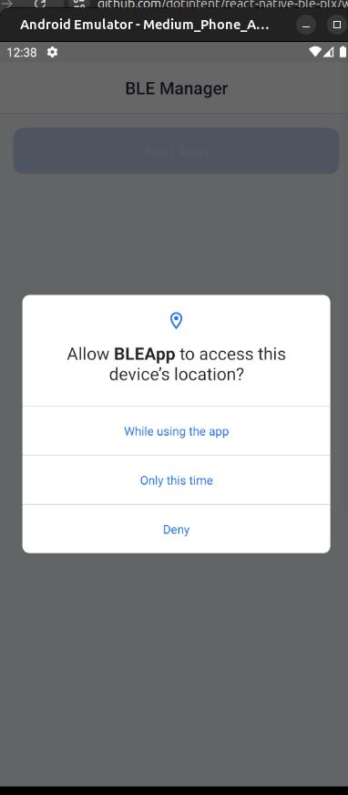
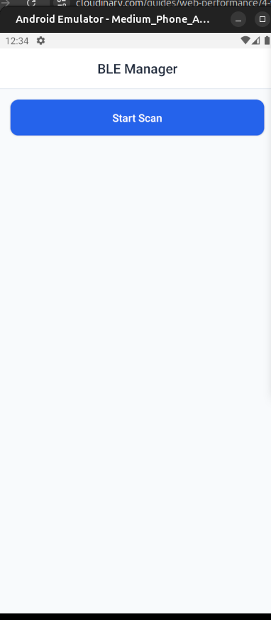
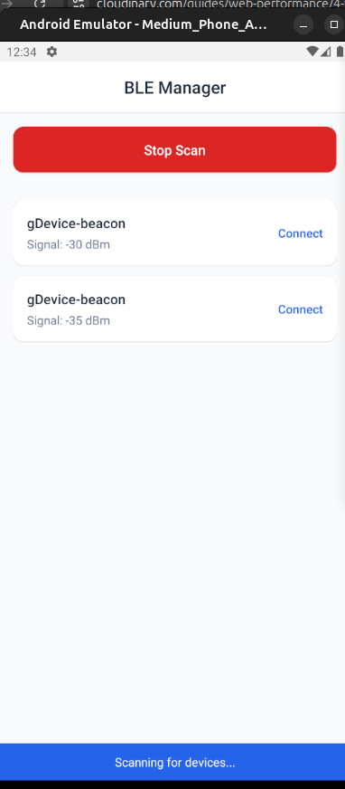

# BLE App Manager

## Table of Contents
1. [About this library](#about-this-library)
2. [How to use](#how-to-use)
   - [Permission & Dashboard](#1-permission--dashboard)
   - [Starting Scanning](#2-starting-scanning)
   - [Connecting to a Device](#3-connecting-to-a-device)
3. [Development](#development)
   - [Clone the Repository](#1-clone-the-repository)
   - [Install Dependencies](#2-install-dependencies)
   - [Start the Metro Bundler](#3-start-the-metro-bundler)
   - [Run the App](#4-run-the-app)
   - [Testing the BLE Features](#5-testing-the-ble-features)
4. [Contribution](#contribution)


## About this library
This app is designed for scanning Bluetooth Low Energy (BLE) devices.

---

## How to use
Here is the flow of this app:

### 1. Permission & Dashboard  
The application will request permission to use Bluetooth, and a popup will appear directing the user to the Bluetooth settings.



---

### 2. Starting Scanning  
- The initial page will only have a button to initiate scanning.
- Click the scan button to search for devices that meet BLE criteria.
- Once clicked, the button's color and text will change, and information about the scanning process will be displayed below.
- If the scan is enough, the stop button can be clicked at any time.



---

### 3. Connecting to a Device  
If the scanning is successful:
- A list of detected devices will appear.
- Click the `Connect` button to connect to a device that supports direct pairing without a confirmation code.
- A disconnect button will appear once the device is successfully connected.



---

## Development

To start contributing or running this app locally, follow these steps:

### 1. Clone the Repository  
Open your terminal and run:
```bash
git clone <repository-url>
cd <repository-directory>
```

### 2. Install Dependencies
Install the required dependencies using npm:
```bash
npm install
```
### 3. Start the Metro Bundler
Run the Metro Bundler:
```bash
npm start
```

### 4. Run the App
For Android
```bash 
npm run android
```
For Ios
```bash
npm run ios
```
### 5. Testing the BLE Features

Ensure that your device has Bluetooth enabled. The app will prompt for permissions and then allow you to scan and connect to BLE devices as described in the usage section.


## Contribution
Feel free to contribute or raise issues via the repository. Happy coding!


